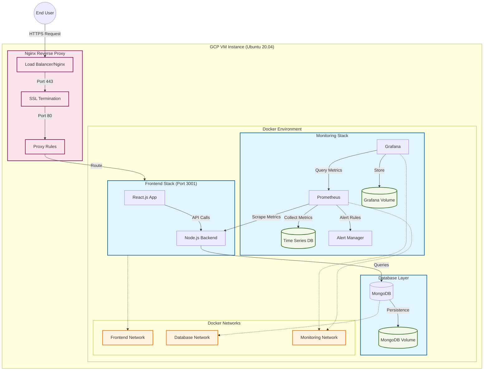

## Architecture Flow Description

### 1. Request Flow
1. User sends HTTPS request
2. Nginx Load Balancer receives request (Port 443)
3. SSL termination occurs
4. Request proxied to appropriate service

### 2. Application Flow
1. Frontend Stack
   - React.js handles UI
   - Node.js processes API requests
   - Communicates via Frontend Network

2. Database Operations
   - MongoDB handles data storage
   - Persistent volume maintains data
   - Secured via Database Network

3. Monitoring Flow
   - Prometheus collects metrics
   - Grafana visualizes data
   - Alert Manager handles notifications
   - Isolated on Monitoring Network

### 3. Network Isolation
- Frontend Network: UI and API traffic
- Database Network: Data operations
- Monitoring Network: Metrics and alerts

### 4. Data Persistence
- MongoDB Volume: Database files
- Grafana Volume: Dashboards and configs
- TSDB: Time series metrics

### 5. Security Layers
1. External Layer
   - SSL/TLS encryption
   - Load balancing
   - DDoS protection

2. Internal Layer
   - Network isolation
   - Container security
   - Volume encryption
