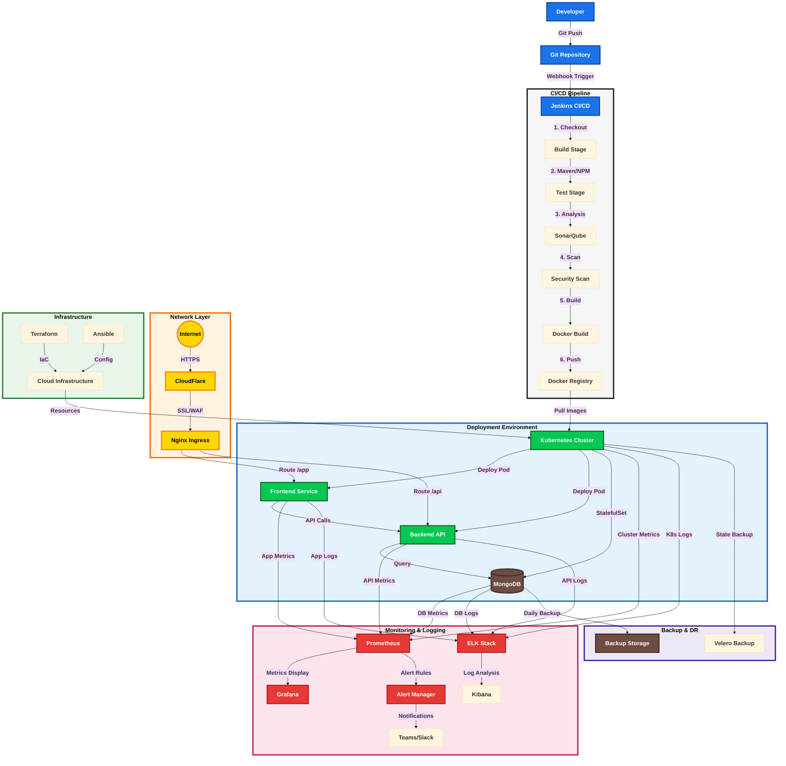

# DevOps Project Architecture Flow

## Detailed Flow Description

### 1. **Development Workflow**
- **Code Push**: Developer commits and pushes code to Git repository
- **Webhook**: Automated trigger to Jenkins on code push
- **Pipeline Start**: Jenkins initiates the CI/CD pipeline

### 2. **CI/CD Pipeline Stages**
1. **Code Checkout**
   - Pull latest code from Git
   - Verify branch and credentials

2. **Build Process**
   - Install dependencies
   - Compile source code
   - Create artifacts

3. **Testing Phase**
   - Unit tests execution
   - Integration testing
   - Code coverage reports

4. **Code Quality**
   - SonarQube analysis
   - Code smells detection
   - Security vulnerabilities check

5. **Security Scanning**
   - Dependency scanning
   - Container security check
   - Compliance verification

6. **Containerization**
   - Build Docker images
   - Tag with version
   - Push to registry

### 3. **Deployment Process**
- **Kubernetes Operations**
  - Pull container images
  - Apply configurations
  - Update deployments
  - Health checks

- **Service Communication**
  - Frontend to Backend API calls
  - Backend to Database queries
  - Service mesh routing

### 4. **Monitoring & Alerting**
- **Metrics Collection**
  - Application performance
  - Resource utilization
  - Response times
  - Error rates

- **Log Management**
  - Centralized logging
  - Log parsing and indexing
  - Search and analysis

- **Alert Handling**
  - Threshold monitoring
  - Alert routing
  - Incident management

### 5. **Network & Security**
- **Traffic Flow**
  - CloudFlare DDoS protection
  - SSL/TLS termination
  - WAF rules
  - Load balancing

- **Access Control**
  - Authentication
  - Authorization
  - Network policies

### 6. **Infrastructure Management**
- **Resource Provisioning**
  - Infrastructure as Code
  - Environment configuration
  - Scaling policies

### 7. **Backup & Disaster Recovery**
- **Backup Procedures**
  - Automated daily backups
  - Point-in-time recovery
  - Backup verification

- **Disaster Recovery**
  - Recovery procedures
  - Failover testing
  - Business continuity
