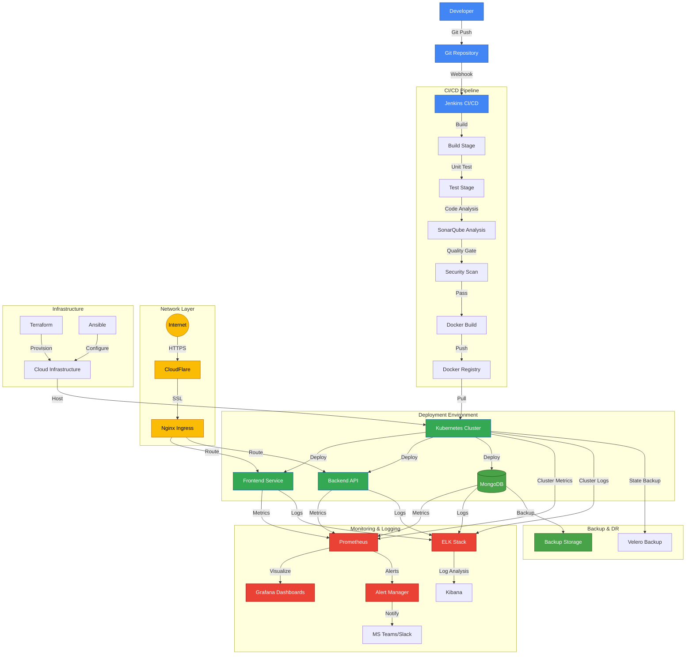

# DevOps Project Architecture Flow

## Flow Description

### 1. Development Flow
- Developer pushes code to Git repository
- Git webhook triggers Jenkins pipeline
- Jenkins orchestrates the CI/CD process

### 2. CI/CD Pipeline
- Build: Compile and package application
- Test: Run unit and integration tests
- SonarQube: Code quality analysis
- Security: Vulnerability scanning
- Docker: Create container images
- Registry: Store container images

### 3. Deployment
- Kubernetes manages container orchestration
- Separate services for Frontend, Backend, and Database
- Automated deployment through CI/CD

### 4. Monitoring & Logging
- Prometheus collects metrics
- Grafana visualizes metrics
- ELK Stack for log aggregation
- Alert Manager for notifications
- Integration with MS Teams/Slack

### 5. Network & Security
- CloudFlare for DDoS protection
- Nginx Ingress for routing
- SSL/TLS encryption
- Network policies and security

### 6. Infrastructure
- Terraform for infrastructure as code
- Ansible for configuration management
- Cloud provider infrastructure

### 7. Backup & Recovery
- Database backups
- Kubernetes state backups using Velero
- Disaster recovery procedures
