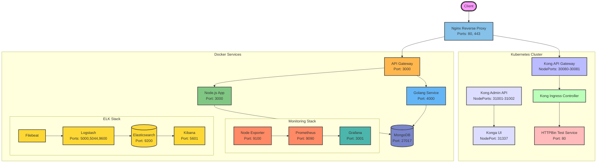

## Architecture Overview

This diagram represents the complete architecture of the DevOps project, including all components:

1. **Frontend Entry Points**
   - Nginx Reverse Proxy (Ports 80, 443)
   - Routes traffic to either Kong API Gateway or the custom API Gateway

2. **Kubernetes Components**
   - Kong API Gateway (NodePorts 30080-30081)
   - Kong Admin API (NodePorts 31001-31002)
   - Konga UI (NodePort 31337)
   - Kong Ingress Controller
   - HTTPBin Test Service

3. **Application Services**
   - Custom API Gateway (Port 3000)
   - Node.js Application (Port 3000)
   - Golang Service (Port 4000)
   - MongoDB Database (Port 27017)

4. **Monitoring Stack**
   - Prometheus (Port 9090)
   - Grafana (Port 3001)
   - Node Exporter (Port 9100)

5. **Logging Stack (ELK)**
   - Elasticsearch (Port 9200)
   - Logstash (Ports 5000, 5044, 9600)
   - Kibana (Port 5601)
   - Filebeat

### Data Flow
- External requests come through Nginx reverse proxy
- Traffic is routed either to Kong API Gateway (for Kubernetes services) or to the custom API Gateway
- Application services (Node.js and Golang) interact with MongoDB
- Monitoring data is collected by Prometheus and visualized in Grafana
- Logs are collected by Filebeat, processed by Logstash, stored in Elasticsearch, and visualized in Kibana
