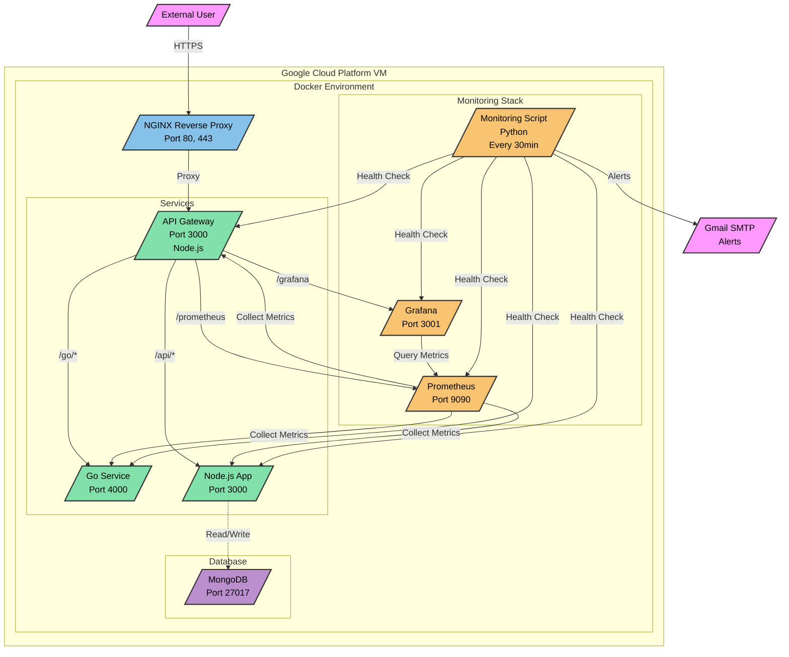

# DevOps Project Architecture

## Components Description

### External Components
- **External User**: Accesses the application through HTTPS
- **Gmail SMTP**: Receives and sends monitoring alerts

### Infrastructure
- **Google Cloud VM**: Hosts all Docker containers
- **Docker**: Container platform running all services

### Core Services
1. **NGINX (Reverse Proxy)**
   - Ports: 80 (HTTP), 443 (HTTPS)
   - Handles SSL termination
   - Routes traffic to internal services

2. **API Gateway (Node.js)**
   - Port: 3000
   - Routes requests to appropriate services
   - Provides unified API interface
   - Endpoints:
     - `/` - API documentation
     - `/health` - Gateway health
     - `/metrics` - Prometheus metrics
     - `/api/*` - Node.js app routes
     - `/go/*` - Go service routes

3. **Go Service**
   - Port: 4000
   - Provides Go-based microservice
   - Endpoints:
     - `/health` - Service health
     - `/info` - Service information

4. **Node.js App**
   - Port: 3000
   - Main application service
   - Connected to MongoDB

5. **MongoDB**
   - Port: 27017
   - Primary database
   - Persistent storage for application data

### Monitoring Stack
1. **Prometheus**
   - Port: 9090
   - Metrics collection and storage
   - Monitors all services

2. **Grafana**
   - Port: 3001
   - Metrics visualization
   - Dashboard for monitoring

3. **Monitoring Script (Python)**
   - Runs every 30 minutes
   - Checks service health
   - Monitors memory usage
   - Sends email alerts for:
     - Service downtime
     - High memory usage (>75%)
     - Container issues

## Security Features
- HTTPS encryption
- Self-signed SSL certificates
- Containerized services
- Internal network isolation
- Secure email alerts (Gmail with app password)

## Data Flow
1. User requests come through HTTPS to NGINX
2. NGINX routes to API Gateway
3. API Gateway directs to appropriate service
4. Services interact with MongoDB as needed
5. Prometheus continuously collects metrics
6. Grafana visualizes metrics from Prometheus
7. Monitoring script checks health and sends alerts

## High Availability Features
- Container restart policies
- Health check endpoints
- Automated monitoring
- Real-time alerts
