```mermaid
%%{init: {
  'theme': 'base',
  'themeVariables': {
    'fontSize': '18px',
    'fontFamily': 'arial',
    'lineWidth': '3px',
    'fontWeight': 'bold'
  }
}}%%

flowchart TD
    %% External Users
    Client(["🌐 External Client"])
    DevOps(["👨‍💻 DevOps Team"])
    
    %% Entry Points
    Client -->|"HTTPS/HTTP\n443/80"| LoadBalancer
    DevOps -->|"Admin Access"| AdminPortal
    
    subgraph "Load Balancer Layer"
        LoadBalancer["<b>🔄 HAProxy Load Balancer</b>\n[haproxy:2.4]\nPorts: 80, 443"]
    end
    
    subgraph "Gateway Layer" 
        LoadBalancer -->|"Web Traffic"| Nginx
        Nginx["<b>🚪 Nginx Reverse Proxy</b>\n[nginx:1.25]\nPorts: 80, 443"]
        
        Nginx -->|"/api/*"| ApiGateway["<b>🌐 API Gateway</b>\n[custom-gateway:1.0]\nPort: 3000"]
        Nginx -->|"/k8s/*"| Kong["<b>👑 Kong Gateway</b>\n[kong:3.4]\nPorts: 30080-30081"]
        
        Kong -->|"Admin API\n8001/8444"| KongAdmin["<b>⚙️ Kong Admin</b>\n[kong:3.4]\nPorts: 31001-31002"]
    end
    
    subgraph "Admin Portal" 
        AdminPortal{"<b>🎛️ Admin Interfaces</b>"}
        KongAdmin -->|"UI - 31337"| Konga["<b>🖥️ Konga Dashboard</b>\n[konga:latest]\nPort: 31337"]
        AdminPortal -->|"Metrics"| Grafana
        AdminPortal -->|"Logs"| Kibana
    end
    
    subgraph "Application Services"
        ApiGateway -->|"Route/Auth"| Services
        Kong -->|"K8s Services"| Services
        
        subgraph "Services Layer"
            direction TB
            NodeService["<b>📦 Node.js Service</b>\n[node-app:1.0]\nPort: 3000"]
            GoService["<b>🚀 Go Service</b>\n[go-service:1.0]\nPort: 4000"]
            AuthService["<b>🔐 Auth Service</b>\n[auth-service:1.0]\nPort: 4001"]
        end
        
        Services -->|"Data Access"| DataStores
    end
    
    subgraph "Data Layer" 
        subgraph "DataStores" 
            direction LR
            MongoDB[("<b>💾 MongoDB</b>\n[mongo:6.0]\nPort: 27017")]
            Redis[("<b>⚡ Redis</b>\n[redis:7.2]\nPort: 6379")]
            Postgres[("<b>🐘 PostgreSQL</b>\n[postgres:15]\nPort: 5432")]
        end
    end
    
    subgraph "Monitoring & Logging"
        Services -->|"Push Metrics"| MonitoringStack
        Services -->|"Send Logs"| LoggingStack
        
        subgraph "MonitoringStack" 
            Prometheus["<b>📊 Prometheus</b>\n[prometheus:v2.45]\nPort: 9090"]
            NodeExporter["<b>📈 Node Exporter</b>\n[node-exporter:1.6]\nPort: 9100"]
            AlertManager["<b>🚨 Alert Manager</b>\n[alertmanager:0.25]\nPort: 9093"]
            Grafana["<b>📉 Grafana</b>\n[grafana:10.0]\nPort: 3001"]
            
            NodeExporter -->|"Metrics"| Prometheus
            Prometheus -->|"Visualize"| Grafana
            Prometheus -->|"Alerts"| AlertManager
        end
        
        subgraph "LoggingStack"
            Filebeat["<b>📡 Filebeat</b>\n[filebeat:8.11.1]"]
            Logstash["<b>🔄 Logstash</b>\n[logstash:8.11.1]\nPorts: 5044,9600"]
            Elasticsearch["<b>🔍 Elasticsearch</b>\n[elasticsearch:8.11.1]\nPort: 9200"]
            Kibana["<b>📊 Kibana</b>\n[kibana:8.11.1]\nPort: 5601"]
            
            Filebeat -->|"Ship Logs"| Logstash
            Logstash -->|"Index"| Elasticsearch
            Elasticsearch -->|"Visualize"| Kibana
        end
    end
    
    %% Styling with bold colors and thick borders
    classDef external fill:#ff9cce,stroke:#333,stroke-width:4px,color:#000
    classDef loadbalancer fill:#B39DDB,stroke:#333,stroke-width:3px,color:#000
    classDef gateway fill:#90CAF9,stroke:#333,stroke-width:3px,color:#000
    classDef service fill:#A5D6A7,stroke:#333,stroke-width:3px,color:#000
    classDef database fill:#9FA8DA,stroke:#333,stroke-width:3px,color:#000
    classDef monitoring fill:#FFAB91,stroke:#333,stroke-width:3px,color:#000
    classDef logging fill:#FFF59D,stroke:#333,stroke-width:3px,color:#000
    classDef admin fill:#F48FB1,stroke:#333,stroke-width:3px,color:#000
    
    class Client,DevOps external
    class LoadBalancer loadbalancer
    class Nginx,ApiGateway,Kong,KongAdmin gateway
    class NodeService,GoService,AuthService service
    class MongoDB,Redis,Postgres database
    class Prometheus,NodeExporter,AlertManager,Grafana monitoring
    class Filebeat,Logstash,Elasticsearch,Kibana logging
    class Konga,AdminPortal admin

```

## Infrastructure Components

### Gateway & Load Balancing
- **HAProxy Load Balancer** (Port 80, 443)
  - High availability and load distribution
  - SSL termination
  - Health checks

- **Nginx Reverse Proxy** (Port 80, 443)
  - Static content serving
  - Request routing
  - Rate limiting

- **API Gateway** (Port 3000)
  - Authentication
  - Request validation
  - Rate limiting
  - Service routing

- **Kong Gateway** (Ports 30080-30081)
  - Kubernetes ingress
  - Service mesh
  - Plugin system

### Application Services
- **Node.js Service** (Port 3000)
  - Main application logic
  - REST API endpoints
  - Business rules

- **Go Service** (Port 4000)
  - High-performance operations
  - Data processing
  - Background tasks

- **Auth Service** (Port 4001)
  - User authentication
  - Token management
  - Access control

### Data Stores
- **MongoDB** (Port 27017)
  - Document storage
  - Application data
  - User profiles

- **Redis** (Port 6379)
  - Session storage
  - Caching
  - Rate limiting data

- **PostgreSQL** (Port 5432)
  - Relational data
  - Transactional operations
  - Analytics data

### Monitoring & Logging
- **Prometheus Stack**
  - Prometheus (9090): Metrics collection
  - Node Exporter (9100): System metrics
  - Alert Manager (9093): Alert handling
  - Grafana (3001): Visualization

- **ELK Stack**
  - Elasticsearch (9200): Log storage
  - Logstash (5044): Log processing
  - Kibana (5601): Log visualization
  - Filebeat: Log shipping

### Security Features
1. **Edge Security**
   - SSL/TLS termination
   - DDoS protection
   - WAF rules

2. **Service Security**
   - Service authentication
   - Rate limiting
   - CORS policies

3. **Data Security**
   - Encrypted connections
   - Access control
   - Audit logging
