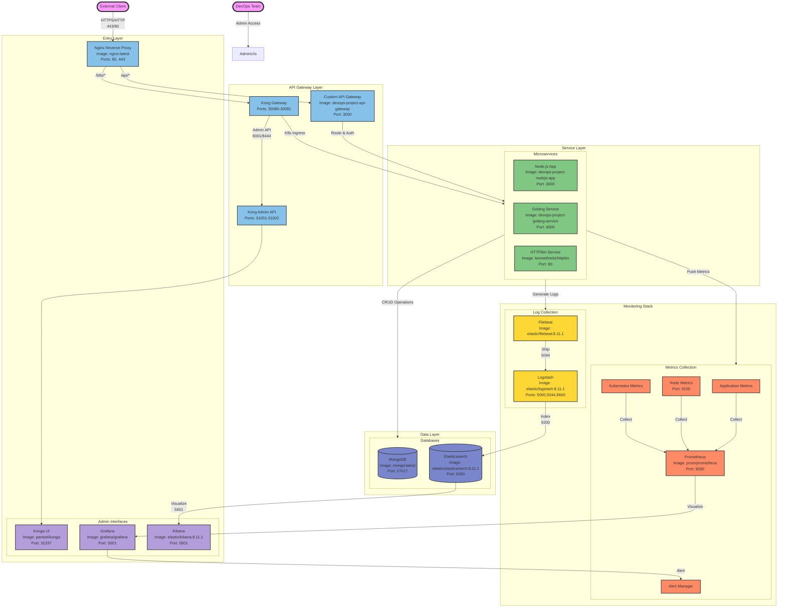

## System Architecture Details

### Docker Images & Versions
1. **Gateway & Proxy**
   - `nginx:latest` - Reverse Proxy
   - `devops-project-api-gateway:latest` - Custom API Gateway
   - Kong (Kubernetes Deployment)

2. **Applications**
   - `devops-project-nodejs-app:latest` - Node.js Application
   - `devops-project-golang-service:latest` - Golang Service
   - `kennethreitz/httpbin` - Test Service

3. **Databases**
   - `mongo:latest` - MongoDB
   - `elastic/elasticsearch:8.11.1` - Elasticsearch

4. **Monitoring & Logging**
   - `prom/prometheus:latest` - Prometheus
   - `grafana/grafana:latest` - Grafana
   - `elastic/filebeat:8.11.1` - Filebeat
   - `elastic/logstash:8.11.1` - Logstash
   - `elastic/kibana:8.11.1` - Kibana

### Network Flow
1. **External Access**
   - All external traffic through Nginx (80/443)
   - Admin access to management UIs through specific ports

2. **API Routing**
   - `/api/*` → Custom API Gateway
   - `/k8s/*` → Kong API Gateway
   - Internal service communication through Docker network

3. **Data Flow**
   - Services → MongoDB (CRUD operations)
   - Metrics → Prometheus → Grafana
   - Logs → Filebeat → Logstash → Elasticsearch → Kibana

### Port Mappings
1. **Public Ports**
   - Nginx: 80, 443
   - Kong: 30080, 30081
   - Grafana: 3001
   - Kibana: 5601

2. **Internal Ports**
   - MongoDB: 27017
   - Elasticsearch: 9200
   - Logstash: 5000, 5044, 9600
   - Node.js App: 3000
   - Golang Service: 4000
   - Prometheus: 9090

### Security Zones
1. **Public Zone**
   - Nginx Reverse Proxy
   - Kong API Gateway
   - Management UIs (with authentication)

2. **Service Zone**
   - Application Services
   - API Gateways
   - Service-to-service communication

3. **Data Zone**
   - Databases
   - Persistent Storage
   - Logging Infrastructure
